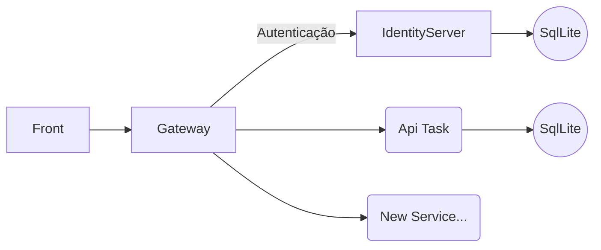

## Desafio de Desenvolvimento em .NET 
Criar uma API RESTful que permitirá aos usuários gerenciar uma lista de tarefas. A API deve ser construída em C# usando a plataforma .NET e deve seguir as melhores práticas de desenvolvimento, incluindo boas práticas de arquitetura, segurança e documentação. 

Aqui estão os requisitos para a API, leia com atenção pra entender os detalhes: 

Mínimo (será desclassificado se não fizer):

### CRUD de Tarefas: 

Crie, leia, atualize e exclua tarefas. 
Cada tarefa deve ter um título, uma descrição, uma data de criação e um status (pendente, em andamento, concluída). 


### Listagem de Tarefas: 

Os usuários devem ser capazes de listar todas as tarefas ou filtrá-las com base em seu status. 


### Autenticação e Autorização: 

A API deve suportar autenticação de usuários. 
Apenas os criadores das tarefas devem poder atualizá-las ou excluí-las. 
As tarefas devem ser visíveis para todos os usuários autenticados. 


### Documentação: 

Documente sua API de forma clara e concisa, preferencialmente usando o Swagger ou ferramenta similar. 


## **Diferenciais (aumenta suas chances de classificação):** 


### Testes Unitários: 

Escreva testes unitários para garantir a robustez e a confiabilidade da API. 


### Segurança: 

Garanta que a API esteja protegida contra ataques comuns, como injeção SQL e ataques de força bruta. 


### Boas Práticas: 

Siga as melhores práticas de desenvolvimento, como o uso de padrões de design apropriados e a separação de preocupações. 


### Escalabilidade: 

 Projete a API para ser escalável, considerando um grande volume de tarefas e usuários. 


### Performance: 

Otimize a API para garantir alta performance e baixa latência.
 

### Logs: 

Implemente logs para rastrear eventos importantes na API, o que pode ser útil para depuração e monitoramento. 
 

### Ferramentas desejáveis: 

Usar uma ORM, preferencialmente o EF Core. 
Utilizar EF Core In-Memory, ou qualquer banco de dados relacional de sua escolha, neste caso, preferencialmente o PostgreSQL. 
 

## Entregáveis: 

Um repositório Git (GitHub, GitLab, etc.) com o código-fonte da API. 
Documentação clara sobre como executar a API localmente. 
Instruções para autenticar-se na API e realizar operações CRUD.  


## Avaliação: 

O candidato será avaliado com base na qualidade do código, conformidade com os requisitos e as melhores práticas, segurança da API, eficiência e clareza da documentação, além da implementação de testes unitários. 

Lembrando que os pontos de 1 a 4 são de entrega obrigatória, sendo assim, os demais pontos sendo uma forma de demonstrar seu conhecimento técnico e domínio sobre o assunto. 

# Documentação do Projeto
Este projeto foi desenvolvido utilizando uma arquitetura baseada em microserviços, composta por três APIs principais:

- Identity Server: Responsável pelo controle de autenticação e autorização dos usuários, gerenciando a emissão e validação de tokens JWT.
- API Gateway: Atua como um proxy reverso, centralizando todas as requisições, autenticando os usuários via token JWT e distribuindo as chamadas para os serviços correspondentes.
- API de Tarefas: Responsável pelo gerenciamento das regras de negócio relacionadas às tarefas cadastradas.
  
O principal objetivo desse projeto foi projetar uma arquitetura escalável, permitindo a adição de novas APIs conforme novas funcionalidades sejam implementadas. O API Gateway serve como ponto central para rotear e balancear as requisições entre os serviços, garantindo flexibilidade e modularidade.

Para facilitar o desenvolvimento, foi utilizado SQLite como banco de dados, em conjunto com Entity Framework (EF) Core e Migrations para gerenciamento da persistência de dados.

Abaixo, segue um diagrama representando a arquitetura do sistema:


## Informações Importantes para a Execução do Projeto
- O projeto foi desenvolvido utilizando .NET 8 e Microsoft Visual Studio Community 2022.
- A persistência de dados foi implementada com Entity Framework (EF) Core, utilizando SQLite e Migrations. Ao iniciar o projeto, o banco de dados local será criado automaticamente, incluindo os dados iniciais de usuários.
- Para o correto funcionamento do sistema, é essencial executar os três serviços simultaneamente.
- Se houver algum problema de conexão, verifique o arquivo appsettings.json e confirme se os endereços configurados correspondem aos serviços em execução.
- O sistema já possui dois usuários pré-cadastrados para fins de teste:
```json
{
  "login":"adriano@email.com",
  "password":"Pass123$"
}
```
```json
{
  "login":"admin@email.com",
  "password":"Pass123$"
}
```
### Exemplo de requisição para gerar o token JWT
```shell
curl --request POST \
  --url https://localhost:7206/User/SignIn \
  --header 'Content-Type: application/x-www-form-urlencoded' \
  --header 'User-Agent: insomnia/2023.5.8' \
  --data 'password=Pass123$' \
  --data login=admin@email.com
```
